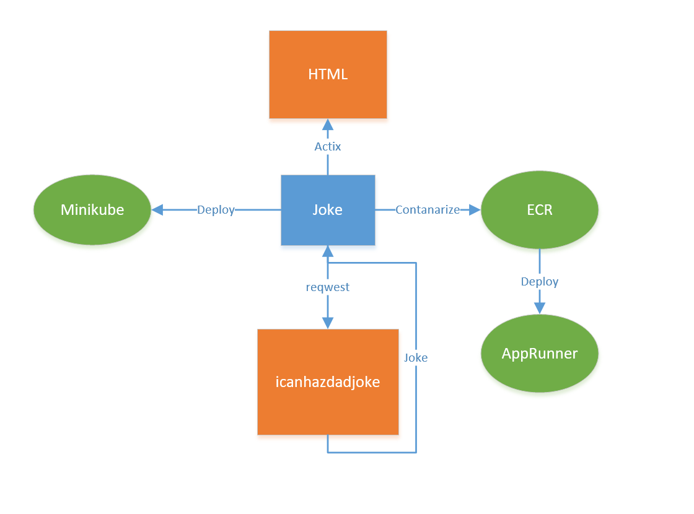
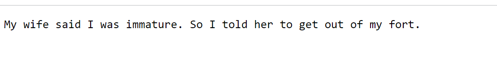
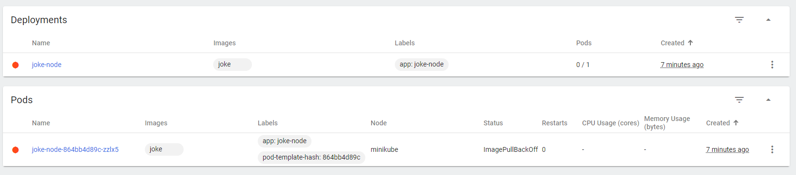
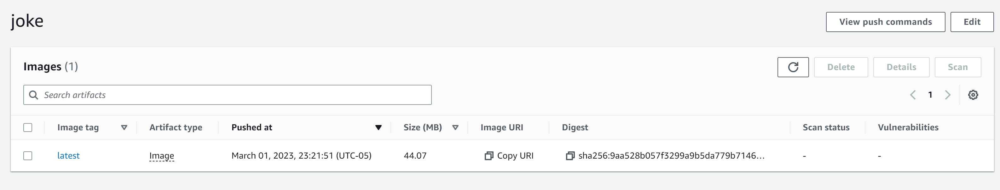
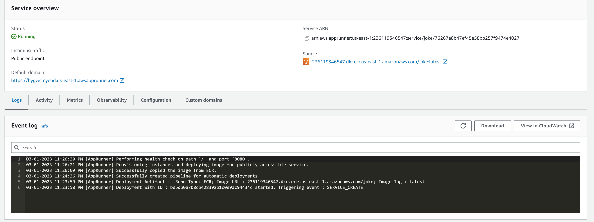

# Joke Microservice

This microservice is built with Rust and Actix-Web to retrieve random jokes from icanhazdadjoke API and display them on a web page.

You can visit
```
https://hygwcmyebd.us-east-1.awsapprunner.co
```
to have a try.

## Structure

## Result

## How to use

To run the microservice, you need to have Rust and Cargo installed on your machine.

1. Clone the repository
2. Run `cargo build` to build the project
3. Run  `cargo run` to start the microservice on http://localhost:8080/
   
## Endpoints
**/**

The home page displays a random joke fetched from the icanhazdadjoke API.

## Deployment
### Docker
To build and run the Docker image:

- Install Docker on your machine.
- Run `make build` to build the Docker image.
- Run `make rundocker` to start the Docker container on port 8080.

### Kubernetes (Minikube)
To deploy the microservice to Minikube:

- Install Minikube on your machine.
- Run `minikube start` to start Minikube.
- Run `minikube dashboard --url` to view dashboard in a new terminal
- Hover over link and "follow link"
- Create a deployment:  `kubectl create deployment joke-node --image=joke`
- View deployment: `kubectl get deployments`
- View pods:  `kubectl get pods`
- Create service and expose it: `kubectl expose deployment joke-node --type=LoadBalancer --port=8080`
- View services:  `kubectl get services`



### AWS Cloud9 & ECR & APPRunner

We can also use ECR & Cloud9 to contanarize the program, and deploy it with APPRunner. Have a try with the following link.

```
https://hygwcmyebd.us-east-1.awsapprunner.co
```




## References

- [rust-cli-template](https://github.com/kbknapp/rust-cli-template)
- [icanhazdadjoke API](https://icanhazdadjoke.com/)
- [coursera-applied-de-kubernetes-lab](https://github.com/nogibjj/coursera-applied-de-kubernetes-lab)
- [Hello MiniKube](https://kubernetes.io/docs/tutorials/hello-minikube/)