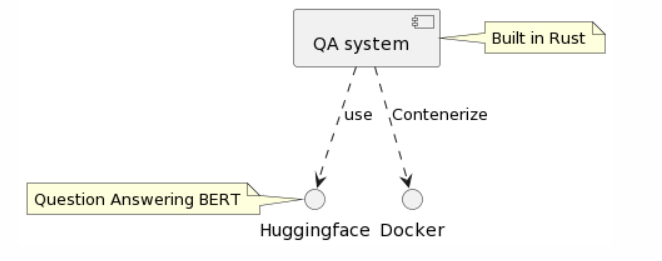

# Question Answering with Rust

This project is a Rust implementation of a question-answering system using the Rust-BERT library. It allows you to enter a context paragraph and a question based on that context, and it returns an answer to the question based on the context.

## Structural Graph


## Requirements
- Rust
- Cargo
- tokio
- Docker

## Installation

1. Clone this repository to your local machine or run in Codespace.

2. Install Rust and Cargo if you haven't already.

3. Install the tokio library by running cargo install tokio.

4. Build the project by running `cargo build --release`.

5. To run the project in a Docker container, build the container by running `docker build -t qa .`

## Usage
To use the question-answering system, run the following command:
```
./target/release/qa
```
You will be prompted to enter a context paragraph and a question. Enter the text and press Enter to get an answer.

Alternatively, you can run the project in a Docker container by running the following command:

```
docker run -it --rm qa
```

This command runs the project in a Docker container and prompts you for input as usual.

## References

* [rust-new-project-template](https://github.com/noahgift/rust-new-project-template)
* [The Rust Programming Language](https://doc.rust-lang.org/book/#the-rust-programming-language)
* [clap](https://docs.rs/clap/latest/clap/)
* [Command Line Applications in Rust](https://rust-cli.github.io/book/index.html)