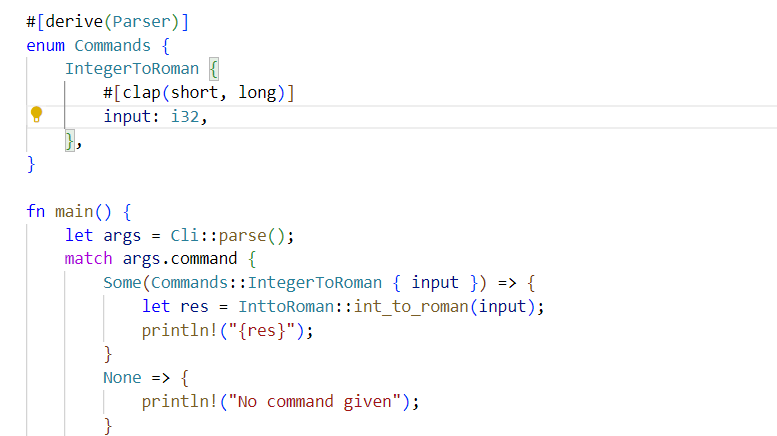
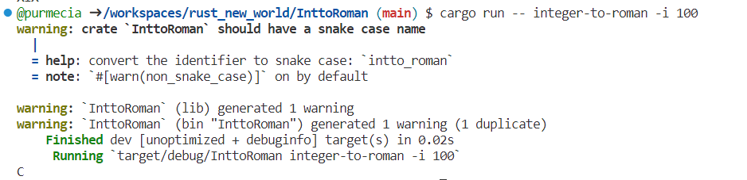

# Integer to Roman

## Usage
Run `cargo run -- integer-to-roman -i [Integer]` to change the integer into roman number!
Like `cargo run -- integer-to-roman -i 19` will output `XIX`
Like `cargo run -- integer-to-roman -i 100` will output `C`

## Code Preview

## Example

## References

* [rust-new-project-template](https://github.com/noahgift/rust-new-project-template)
* [The Rust Programming Language](https://doc.rust-lang.org/book/#the-rust-programming-language)