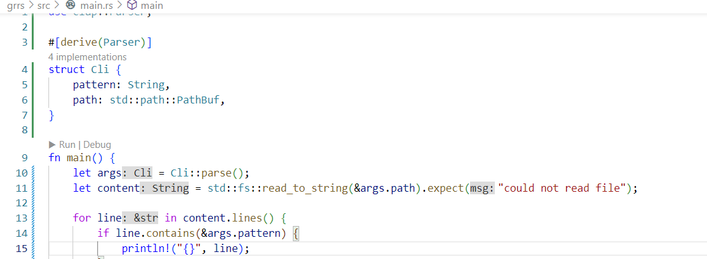
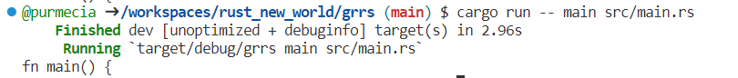

# grrs
A command line (CLI) application that can be used to search the line with the key word you want in a file!

## Usage
We can user the CLI app as `cargo -- [pattern] [file]`. `[pattern]` is the key word you would like to search, and `[file]` is the the address of the file you want to search in.

For example, by commanding 
`cargo run -- main src/main.rs`, we can print all lines that contain `main` in file `src/main.rs`.
## Code Preview

## Example

## References

* [rust-new-project-template](https://github.com/noahgift/rust-new-project-template)
* [The Rust Programming Language](https://doc.rust-lang.org/book/#the-rust-programming-language)
* [clap](https://docs.rs/clap/latest/clap/)
* [Command Line Applications in Rust](https://rust-cli.github.io/book/index.html)