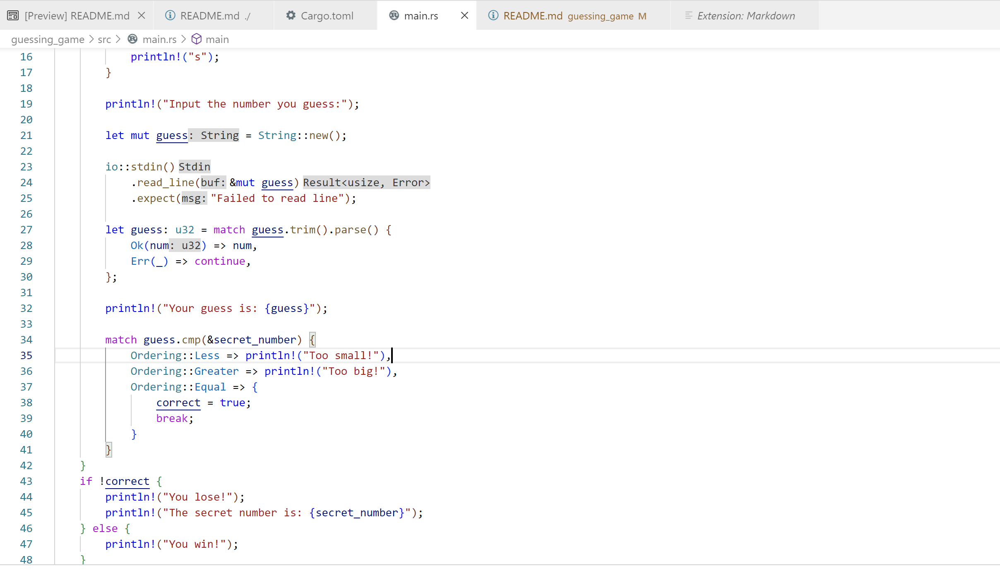
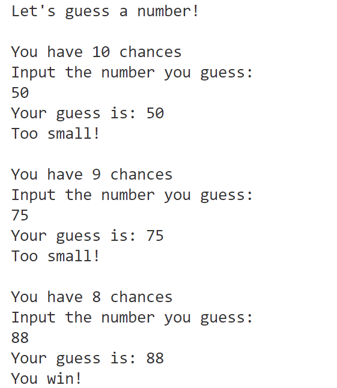

# Guessing Game

## Usage
Run `make all` to guess a secret number!
- You will have ten chances to guess the number
- You will get a hint whether the number you guess is too big or too small
- If you guess this number within ten times, you win. Otherwise, you lose.
## Code Preview

## Example

## References

* [rust-new-project-template](https://github.com/noahgift/rust-new-project-template)
* [The Rust Programming Language](https://doc.rust-lang.org/book/#the-rust-programming-language)