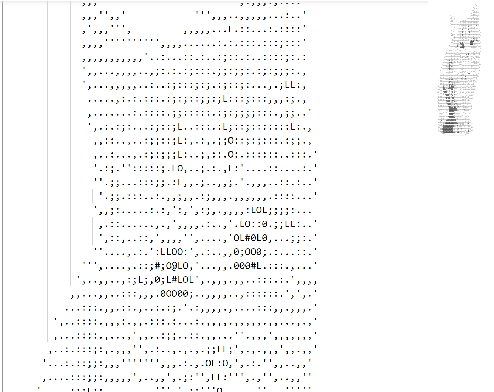

# Image to ASCII

## Usage
Run `cargo -- -i [img path] -p [output path] -r [resolution] -p` to transform a image to ASCII iamge. 

## Example

## References

* [rust-new-project-template](https://github.com/noahgift/rust-new-project-template)
* [The Rust Programming Language](https://doc.rust-lang.org/book/#the-rust-programming-language)