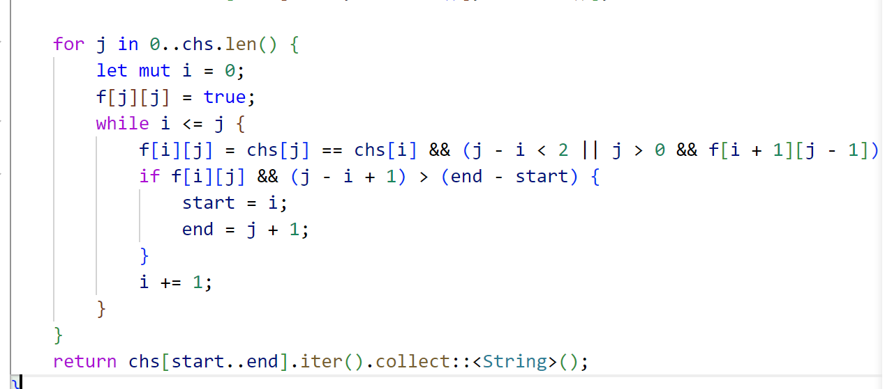
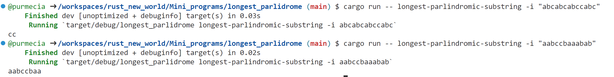

# Longest Parlindrome

## Usage
Run `cargo run -- cargo run -- longest-parlindromic-substring -i [string]` to find out the longest parlindrome in a given string.

Like `cargo run -- cargo run -- longest-parlindromic-substring -i "aaa"` will output `aaa`

Like `cargo run -- cargo run -- longest-parlindromic-substring -i "aabccbaaabab"` will output `aabccbaa`

## Code Preview

## Example

## References

* [rust-new-project-template](https://github.com/noahgift/rust-new-project-template)
* [The Rust Programming Language](https://doc.rust-lang.org/book/#the-rust-programming-language)