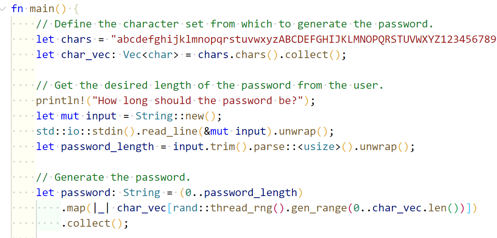

# Password generator
## Usage
Random password is hard to think of by ourselves.

Run `cargo run` to generate a random password with given length!

## Code Preview

## Example
```
@purmecia ➜ /workspaces/rust_new_world/Mini_programs/password_generate (main) $ cargo run
    Finished dev [unoptimized + debuginfo] target(s) in 0.02s
     Running `target/debug/password_generate`
How long should the password be?
20
Password: Ois1k[S,Aw8.PylutUA#
```
## References

* [rust-new-project-template](https://github.com/noahgift/rust-new-project-template)
* [The Rust Programming Language](https://doc.rust-lang.org/book/#the-rust-programming-language)