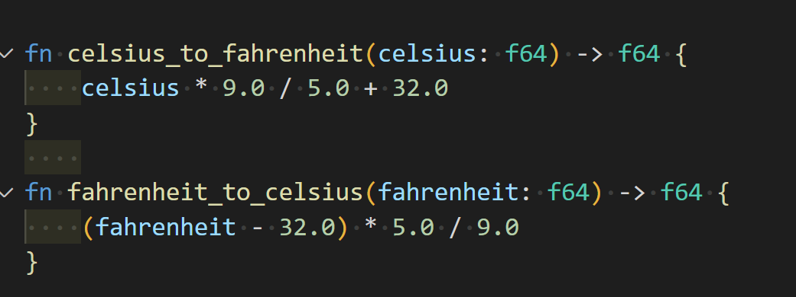

# Temperature Converter

A simple command-line application that converts temperatures between Celsius and Fahrenheit, written in Rust.

Run `cargo run` to run the temperator converter.

## Code Preview

## Example

Follow the prompts to convert temperatures between Celsius and Fahrenheit:
```
Welcome to the Temperature Converter!
Please choose the conversion you would like to perform:
1: Celsius to Fahrenheit
2: Fahrenheit to Celsius
3: Quit
2
Enter the temperature to be converted:
74
74.00 Fahrenheit is equal to 23.33 Celsius
Please choose the conversion you would like to perform:
1: Celsius to Fahrenheit
2: Fahrenheit to Celsius
3: Quit
1
Enter the temperature to be converted:
25
25.00 Celsius is equal to 77.00 Fahrenheit
Please choose the conversion you would like to perform:
1: Celsius to Fahrenheit
2: Fahrenheit to Celsius
3: Quit
3
```
## References

* [rust-new-project-template](https://github.com/noahgift/rust-new-project-template)
* [The Rust Programming Language](https://doc.rust-lang.org/book/#the-rust-programming-language)